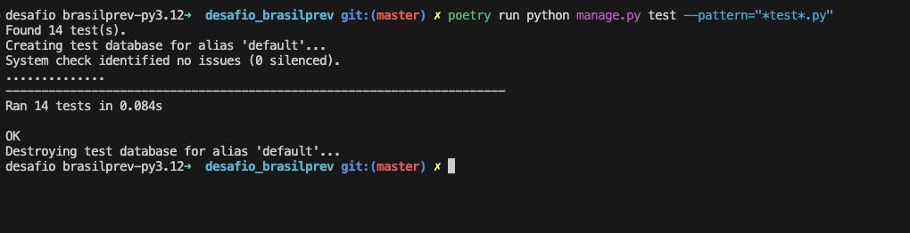

# Desafio Brasilprev

## O desafio é construir uma API REST, que possibilite executar as seguintes ações:

- Cadastro de cliente
- Cadastro de produto
- Contratação de plano
- Resgate de plano
- Aporte extra

## Stack que utilizei:

- Docker
- Python
- Django
- PostgreSQL
- Django REST Framework

## Variáveis de ambiente

    DEBUG=True
    SECRET_KEY=arandomstring
    ALLOWED_HOSTS=*,
    DB_ENGINE=django.db.backends.postgresql
    DB_NAME=
    DB_USER=
    DB_PASSWORD=
    DB_HOST=db
    DB_PORT=5432
    RUN_PORT=8000
    RUN_HOST=0.0.0.0

## Instalação via Poetry

- Duplicar o arquivo de variáveis de ambiente e renomealo para .env e configurar as variáveis locais
	> cp .env.sample .env

- Instalar os requisitos
	> poetry install

- Rodar as migrações para criar as tabelas no banco de dados
	> poetry run python manage.py migrate

- Subir o servidor local
	> poetry run python manage.py runserver

## Instalação via Docker

- Fazer o build das imagens
	> docker compose build

- Subir os containers
	> docker compose up

## Testes
- Rodar testes com Poetry
    > poetry run python manage.py test --pattern="*test*.py"
- Rodar testes com Docker
    > docker compose exec web poetry run python manage.py test --pattern="*test*.py"

# Evidências de testes

## Swagger do projeto

- [Swagger](http://localhost:8000/swagger/)
>>>>>>> 0fc8a49 (correções documentação)

## DRF

- [Planos](http://localhost:8000/planos/)
- [Produtos](http://localhost:8000/produtos/)
- [Clientes](http://localhost:8000/clientes/)
- [Aportes](http://localhost:8000/planos/aportes/)
- [Resgates](http://localhost:8000/planos/aportes/)